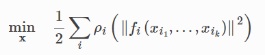
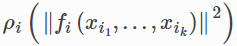
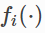
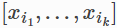
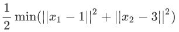

# NOPY

## Introduction
NOPY is an extension of [scipy.optimize.least_squares](https://docs.scipy.org/doc/scipy/reference/generated/scipy.optimize.least_squares.html). 
It provides a much more flexible and easier-to-use interface than the original scipy.optimize.least_squares. 
You will love it if you are familiar with [Ceres Solver](http://www.ceres-solver.org/).

NOPY can solve robustified non-linear least squares problems of the form



The expression  is known as a residual block, where 
 is a residual function that depends on one or more variables .
 
## Example
We wanna minimize the following naive cost function



The first step is to define residual functions.
```python
def f1(x1):
    return x1 - 1
    
def f2(x2):
    return x2 - 3
```

Then we define variables with some initial values.
```python
x1 = numpy.array([-1], dtype=numpy.float64)
x2 = numpy.array([0], dtype=numpy.float64)
```

Next, we build the least squares problem and use the '2-point' finite difference method to
estimate Jacobian matrix of each residual block.
```python
problem = nopy.LeastSquaresProblem()
problem.add_residual_block(1, f1, x1, jac_func='2-point')
problem.add_residual_block(1, f2, x2, jac_func='2-point')
```
The first argument of add_residual_block is the dimension of residual function. 
In this example, the residual function return a scalar, so the dimension is 1.

Finally, we solve it.
```python
problem.solve()
```

Now all variables should have the right value that make the cost function minimum.
```python
print(x1)   # x1 = 1
print(x2)   # x2 = 3
```

If you don't want to change one or more variables during optimization, just call
```python
problem.fix_variables(x1)
```
and unfix them with
```python
problem.unfix_variables(x1)
```

NOPY support robust loss functions. You can specify loss function for each residual block, like bellow
```python
problem.add_residual_block(1, f1, x1, jac_func='2-point', loss='huber')
```

Custom jacobian function and loss function are also supported just like scipy.optimize.least_squares.
You can find more examples in the 'examples' folder.
